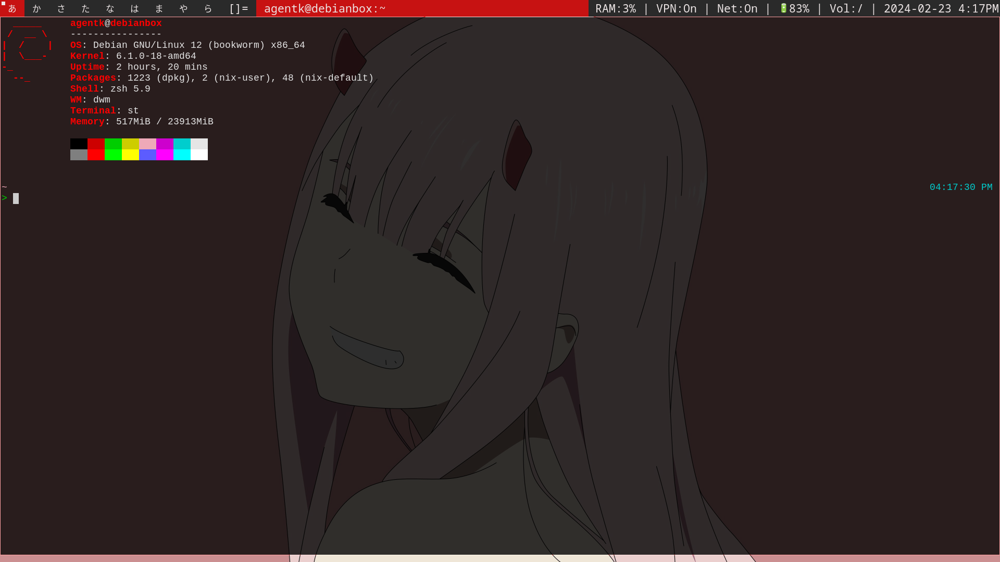

# 1. Debian DWM Bootsrap
Simple script to install suckless [DWM](https://dwm.suckless.org/) on bare minimal Debain 12.



# 2. Prerequisite
Make sure the user has **sudo** previlidge and the machine has access to the internet.

## Sudo

On minimal Debian, sudo is not pre-installed.

```
% su
$ apt install sudo
$ usermod -aG sudo username
```
Swap username with your actual username, reboot the machine and loging as user.

# 3. Clone the repo

```
$ sudo apt install git
$ git clone https://github.com/Kouei-Lin/debian-dwm-bootstrap ~/debian-dwm-bootstrap
```

# 4. Run the script

```
$ cd ~/debian-dwm-bootstrap
$ chmod +x dwm.sh
$ ./dwm.sh
```

# 5. Start DWM

The script should auto start into DWM, if not, type in `startx` in the terminal to start DWM.

Next time boot up your machine, same just type `startx` to start DWM.

# 6. Wallpaper
I set wallpaper to the `bg.jpg` in the repo. 

Set the wallpaper to whatever you like using `feh --bg-fill /path/to/your/image.jpg`.

# 7. DWM Patches
Patch your DWM by visting [DWM Patches](https://dwm.suckless.org/patches/)!!

Default DWM keybindings can be checked via this community made [cheatsheet](https://gist.github.com/erlendaakre/12eb90eef84a3ab81f7b531e516c9594).
